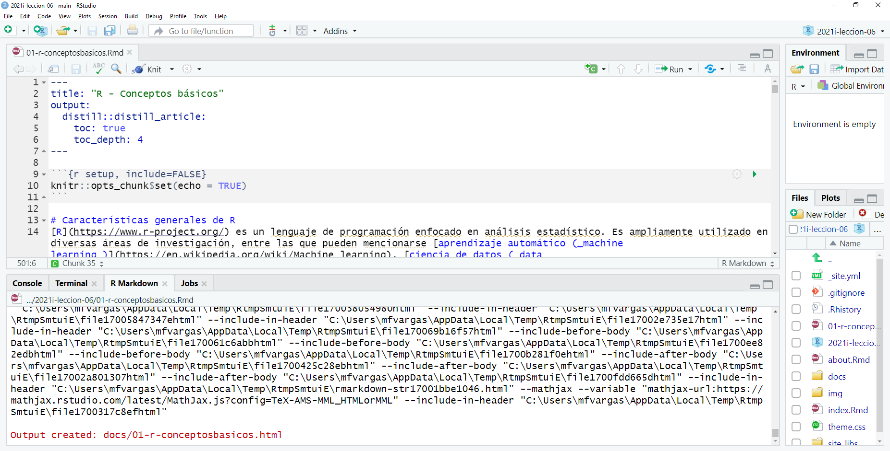

```{r setup, include=FALSE}
knitr::opts_chunk$set(echo = TRUE)
```

# Resumen
En esta lección, se estudiarán los conceptos básicos del lenguaje de programación R, incluyendo:

- Características generales de R.
- El ambiente de desarrollo RStudio.
- Funciones y paquetes.
- Tipos de datos.

# Trabajo previo
- Instale [R](https://cloud.r-project.org/) y [RStudio](https://www.rstudio.com/products/rstudio/download/) en su computadora. Puede aceptar las opciones que los programas instaladores le presentan por defecto. Si lo desea, puede ver los siguientes videos que muestran detalladamente el proceso de instalación en los sistemas operativos [Windows](https://www.youtube.com/watch?v=k0oCZdJPsDU), [macOS](https://www.maximaformacion.es/blog-dat/instala-r-y-rstudio-en-mac-os/) y [Linux (Ubuntu)](https://www.youtube.com/watch?v=3ni-jP2qEWg).
- Instale el sistema para control de versiones [Git](https://git-scm.com/downloads).
- Lea los capítulos del 1 al 12 de [Grolemund, G., & Wickham, H. (2014). Hands-On Programming with R](https://rstudio-education.github.io/hopr/).

# Características generales de R
[R](https://www.r-project.org/) es un lenguaje de programación enfocado en análisis estadístico. Es ampliamente utilizado en diversas áreas de investigación, entre las que pueden mencionarse [aprendizaje automático (_machine learning_)](https://en.wikipedia.org/wiki/Machine_learning), [ciencia de datos (_data science_)](https://en.wikipedia.org/wiki/Data_science) y [_big data_](https://en.wikipedia.org/wiki/Big_data), con aplicaciones en campos como biomedicina, bioinformática y finanzas, entre muchos otros. Fue creado por Ross Ihaka y Robert Gentleman en la Universidad de Auckland, Nueva Zelanda, en 1993.

Algunas de las principales características de este lenguaje son:

* Es [interpretado](https://en.wikipedia.org/wiki/Interpreter_(computing)): las instrucciones se traducen una por una a [lenguaje máquina](https://en.wikipedia.org/wiki/Machine_code), a diferencia de los [lenguajes compilados](https://en.wikipedia.org/wiki/Compiler), que traducen de manera conjunta las instrucciones de una unidad completa (ej. un programa o una biblioteca). Los lenguajes interpretados tienden a ser más lentos que los compilados, pero también son más flexibles.
* Es [multiplataforma](https://en.wikipedia.org/wiki/Cross-platform_software): puede ejecutarse en los sistemas operativos más populares (ej. Microsoft Windows, macOS, Linux).
* Tiene un [sistema de tipos de datos dinámico](https://pythonconquerstheuniverse.wordpress.com/2009/10/03/static-vs-dynamic-typing-of-programming-languages/): las variables pueden tomar diferentes tipos de datos (ej. textuales, numéricos) durante la ejecución del programa, a diferencia del caso de un sistema de tipos de datos estático, en el que las variables solo pueden tener un tipo de datos.
* Soporta varios [paradigmas de programación](https://en.wikipedia.org/wiki/Programming_paradigm): los paradigmas son estilos o enfoques teóricos de programación. R soporta los paradigmas de [programación funcional](https://en.wikipedia.org/wiki/Functional_programming), [programación orientada a objetos](https://en.wikipedia.org/wiki/Object-oriented_programming), [programación imperativa](https://en.wikipedia.org/wiki/Imperative_programming) y [programación procedimental](https://en.wikipedia.org/wiki/Procedural_programming).

R es un proyecto de [software libre](https://en.wikipedia.org/wiki/Free_software) que se comparte mediante una licencia [GNU General Public Licence (GNU GPL)](https://www.gnu.org/licenses/old-licenses/gpl-2.0.html). Esta característica permite que la funcionalidad original de R pueda ser ampliada mediante bibliotecas o paquetes desarrollados por la comunidad de programadores.

Para programar en R, puede utilizarse una interfaz de línea de comandos y también ambientes de desarrollo integrados (IDE, _integrated development environment_) como [Jupyter](https://jupyter.org/) o [RStudio](https://rstudio.com/).

# El ambiente de desarrollo RStudio
[RStudio](https://www.rstudio.com/) es el IDE más popular para el lenguaje R. Está disponible en una versión de escritorio (RStudio Desktop) y en una versión para servidor (RStudio Server). Esta última permite la conexión de varios usuarios a través de un navegador web. RStudio se ofrece también como un servicio en la nube, a través de [RStudio Cloud](https://www.rstudio.com/products/cloud/). 

<figure>
  
  <figcaption>
    Interfaz de RStudio.
  </figcaption>
</figure>

Además de edición de código fuente en R (y otros lenguajes), RStudio contiene capacidades para depurar código y visualizar datos en formatos tabulares, gráficos y de mapas.

# Funciones
R, al igual que otros lenguajes de programación, estructura su funcionalidad en unidades de [código fuente](https://en.wikipedia.org/wiki/Source_code) llamadas [funciones](https://cran.r-project.org/doc/manuals/r-release/R-lang.html#Functions). Cada función realiza una tarea específica como, por ejemplo, un cálculo matemático y, por lo general, retorna un valor como salida. Todas las funciones tienen un nombre y, opcionalmente, un conjunto de argumentos que especifican los datos de entrada que procesa la función. Los argumentos se escriben entre paréntesis redondos (```()```) y estos siempre deben incluirse, aún en el caso de que la función no tenga ningún argumento. Si la función tiene varios argumentos, deben separarse mediante comas (```,```).

## Ejemplos
La función [print()](https://rdrr.io/r/base/print.html) recibe como argumento un valor (ej. un texto o un número) para imprimirlo en la pantalla. En el siguiente fragmento de código en R, se utiliza ```print()``` para imprimir la hilera ["Hola mundo"](https://en.wikipedia.org/wiki/%22Hello,_World!%22_program). Nótese el uso del símbolo ```#``` para comentarios (i.e. texto que no es código ejecutable).

```{r collapse=TRUE}
# Impresión de una hilera de caracteres
print("Hola mundo")
```

La función  [mean()](https://rdrr.io/r/base/mean.html) retorna la media aritmética del argumento de entrada. En el siguiente ejemplo, se calcula la media de los números de un vector creado a su vez con la función [c()](https://rdrr.io/r/base/c.html).

```{r collapse=TRUE}
# Media aritmética
mean(c(2, 4, 5, 9))
```

La función [getwd()](https://rdrr.io/r/base/getwd.html) (_get working directory_) retorna la ruta del directorio de trabajo de la sesión actual de R. Este es el directorio en el cual R espera encontrar, por ejemplo, archivos de datos.

```{r collapse=TRUE}
# Impresión del directorio de trabajo
getwd()
```

La función [setwd()](https://rdrr.io/r/base/getwd.html) (_set working directory_) establece la ruta del directorio de trabajo de la sesión actual de R. Como argumento, recibe una hilera de texto con la ruta.

**Note las barras utilizadas para separar los subdirectorios: / (no \\)**

```{r eval=FALSE}
# Definición del directorio de trabajo (la ruta debe existir)
setwd("C:/Users/mfvargas")

# Directorio con espacios, tildes y eñes
setwd("C:/Users/mfvargas/mi directorio con espacios y tildes áéíóúñ")
```

**
Ejercicio:  
a. Obtenga la ruta de su directorio de trabajo con la función ```getwd()```.  
b. Si lo desea, cambie la ruta de su directorio de trabajo con la función ```setwd()```. Verifique el cambio con ```getwd()```.  
**

## Argumentos
Los argumentos de las funciones tienen nombres que pueden especificarse, en caso de ser necesario. En algunos casos, el orden y el tipo de datos de los argumentos permiten que el interpretador de R conozca cuál es cada uno.

En el siguiente ejemplo, se utilizan los argumentos ```x```, ```xlab``` y ```ylab``` de la función [plot()](https://rdrr.io/r/graphics/plot.default.html) para especificar la fuente de datos y las etiquetas de los ejes x e y de un gráfico de dispersión.

```{r collapse=TRUE}
# Gráfico de dispersón del conjunto de datos "cars" con etiquetas en los ejes x e y
plot(
  x=cars, 
  xlab="Velocidad (mph)", 
  ylab="Distancia requerida para frenar (pies)"
)
```

**
Ejercicio: estudie la documentación de la función ```plot()``` y agregue al gráfico anterior:  
a. Un título.  
b. Un subtítulo.  
**

## Ayuda
Para obtener ayuda de una función desde la línea de comandos de R, puede utilizarse un signo de pregunta (```?```) seguido del nombre de la función o bien la función [help()](https://rdrr.io/r/utils/help.html). Por ejemplo:

```{r eval=FALSE}
# Ayuda de la función setwd()
?setwd
help(setwd)
```

Adicionalmente, puede utilizarse la función [apropos()](https://rdrr.io/r/utils/apropos.html) para buscar funciones por palabras clave.

```{r eval=TRUE}
# Búsqueda, por palabras clave, de funciones relacionadas con "mean" (media aritmética). Note las comillas ("").
apropos("mean")
```

La función [example()](https://rdrr.io/r/utils/example.html) presenta ejemplos sobre el uso de una función.

```{r eval=TRUE}
# Ejemplos de uso de la función mean()
example("mean")
```

Por otra parte, el sitio [All R Documentation](https://rdrr.io/r/) reúne documentación de funciones de una gran cantidad de paquetes de R. También puede obtenerse ayuda sobre una función en los buscadores de Internet (ej. Google), además de ejemplos, tutoriales y otros materiales de apoyo. 

## Conjuntos de datos para pruebas
Para efectos de pruebas y ejemplos, la distribución base de R incorpora varios conjuntos de datos que pueden listarse con la función [data()](https://rdrr.io/r/utils/data.html). Para obtener información acerca de un conjunto de datos en particular, puede utilizarse el operador  ```? ```.

```{r eval=FALSE}
# Información sobre todos los conjuntos de datos incorporados en la distribución base de R
data()

# Información sobre el cojunto de datos "cars"
?cars

# Información sobre el cojunto de datos "Iris"
?iris
```

# Paquetes
Las funciones de R se distribuyen mediante paquetes. Cada paquete contiene un conjunto de funciones y estructuras de datos relacionadas entre sí. Para utilizar un paquete, primero debe cargarse (en la memoria del computador) con la función [library()](https://rdrr.io/r/base/library.html).

```{r}
# Carga del paquete stats
library(stats)
```

Algunos paquetes están contenidos en la distribución base de R y otros deben instalarse de manera separada con la función [install.packages()](https://rdrr.io/r/utils/install.packages.html).

En el siguiente ejemplo, se instala el paquete [PASWR2](https://cran.r-project.org/package=PASWR2), el cual contiene el conjunto de datos [TITANIC3](https://rdrr.io/cran/PASWR2/man/TITANIC3.html).

```{r eval=FALSE}
# Instalación del paquete PASWR2 (note las comillas)
install.packages("PASWR2")
```

El paquete PASWR2 se carga con ```library()```. 

```{r}
# Carga de PASWR2
library(PASWR2)
```

El conjunto de datos  ```TITANIC3 ``` puede visualizarse con la función [View()](https://rdrr.io/r/utils/View.html).

```{r eval=FALSE}
# Visualización del conjunto de datos TITANIC3
View(TITANIC3)
```

Para visualizar gráficamente el conjunto de datos, el siguiente gráfico de barras muestra la distribución de pasajeros por clase.

```{r collapse=TRUE}
# Cantidades de pasajeros por clase
table(TITANIC3$pclass)

# Gráfico de barras por clase de pasajero
barplot(
  height=table(TITANIC3$pclass),
  main="Distribución de pasajeros del Titanic por clase",
  xlab = "Clase",
  ylab = "Cantidad de pasajeros"  
)
```

La distribución por cada clase puede dividirse en fallecidos y sobrevivientes.

```{r collapse=TRUE}
# Cantidades de pasajeros fallecidos y sobrevivientes por clase
# (0 corresponde a fallecidos y 1 a sobrevivientes)
table(TITANIC3$survived, TITANIC3$pclass)
```

El siguiente gráfico muestra en un gráfico de barras apiladas la distribución de pasajeros sobrevivientes y fallecidos en cada clase.

```{r collapse=TRUE}
# Gráfico de barras apiladas
barplot(
  height = table(TITANIC3$survived, TITANIC3$pclass),
  main = "Distribución de pasajeros fallecidos y sobrevivientes por clase",
  xlab = "Clase",
  ylab = "Cantidad de pasajeros",
  col = topo.colors(2)
)

# Leyenda
legend(
  x = "topleft",
  inset = 0.03,
  legend = c("Fallecidos", "Sobrevivientes"),
  fill = topo.colors(2),
  horiz = TRUE
)
```

La misma información se muestra seguidamente en un gráfico de barras agrupadas.

```{r collapse=TRUE}
# Gráfico de barras agrupadas
barplot(
  height = table(TITANIC3$survived, TITANIC3$pclass),
  main = "Distribución de pasajeros fallecidos y sobrevivientes por clase",
  xlab = "Clase",
  ylab = "Cantidad de pasajeros",  
  col = topo.colors(2),
  beside = TRUE
)

# Leyenda
legend(
  x = "topleft",
  inset = 0.03,
  legend = c("Fallecidos", "Sobrevivientes"),
  fill = topo.colors(2),
  horiz = TRUE
)
```

**
Ejercicio:  
a. Muestre la distribución de pasajeros fallecidos y sobrevivientes por sexo en un gráfico de barras apiladas.  
b. Muestre la distribución de pasajeros fallecidos y sobrevivientes por sexo en un gráfico de barras agrupadas.  
**

# Tipos de datos
R puede trabajar con varios [tipos de datos básicos](https://cran.r-project.org/doc/manuals/r-release/R-lang.html#Basic-types), entre los que están números, caracteres (i.e. textos) y lógicos. También puede trabajar con [tipos compuestos](https://cran.r-project.org/doc/manuals/r-release/R-lang.html#Special-compound-objects), como factores y _data frames_.

R proporciona acceso a los datos a través de objetos. Un objeto es una entidad que tiene asociadas propiedades (i.e. datos) y métodos (i.e. funciones) para manipular esas propiedades. Un objeto puede ser, por ejemplo, un número, una hilera de texto, un vector o una matriz.

Hay muchas formas de crear objetos en R. Una de las más sencillas es con los operadores de asignación. Estos son ```=``` y ```<-``` (o ```->```). Por ejemplo, las siguientes sentencias crean un número, un texto y un vector.

```{r collapse=TRUE}
# Número
x <- 10
x

# Otro número
20 -> y
y

# Hilera de caracteres
nombre <- 'Manuel'
nombre

# Vector de hileras de caracteres
dias <- c('Domingo', 'Lunes', 'Martes', 'Miércoles', 'Jueves', 'Viernes', 'Sábado')
dias
```

Tanto ```x```, como ```nombre``` como ```dias``` son variables. Una variable es una etiqueta que se le asigna a un objeto. Una variable debe comenzar con una letra.

El tipo de una variable puede consultarse con la función [typeof()](https://rdrr.io/r/base/typeof.html). Por ejemplo:

```{r collapse=TRUE}
typeof(x)
typeof(y)
typeof(nombre)
typeof(dias)
```

A continuación, se describen con más detalle algunos de los tipos de datos utilizados en el lenguaje R.

## Tipos básicos
R define [seis tipos de datos básicos](https://cran.r-project.org/doc/manuals/r-release/R-lang.html#Basic-types). En esta sección, se describen los más utilizados durante este curso.

### Números
Pueden ser enteros (```integer```) o decimales (```double```). Se utilizan en diversos tipos de operaciones, incluyendo las aritméticas (ej. suma, resta, multiplicación, división).

```{r collapse=TRUE}
# Declaración de variables numéricas
x <- 5
y <- 0.5

# Suma
x + y

# Tipos de datos numéricos
typeof(x)
typeof(y)
typeof(x + y)
```

Para declarar números enteros puede usarse el sufijo ```L``` o la función [as.integer()](https://rdrr.io/r/base/integer.html).

```{r collapse=TRUE}
# Números enteros
x <- 10L
y <- as.integer(15)

# Multiplicación
x * y

# Tipos de datos enteros
typeof(x)
typeof(y)
typeof(x * y)
```

Nótese que al declararse una variable numérica, ya sea que tenga o no punto decimal, R la considera por defecto de tipo ```double```. Para que se considere de tipo ```integer```, debe utilizarse el sufijo  ```L ``` o la función  ```as.integer()```.

### Caracteres
Se utilizan para representar textos. Deben estar encerrados entre comillas simples (```''```) o dobles (```""```).

```{r collapse=TRUE}
# Hileras de caracteres
nombre <- "María"
apellido <- "Pérez"

# Concatenación mediante la función paste()
paste(nombre, apellido)
```

### Lógicos
Los objetos lógicos (también llamados _booleanos_) tienen dos posibles valores: verdadero (```TRUE```) o falso (```FALSE```).

```{r collapse=TRUE}
# Variable lógica
a <- 1 < 2
a

# Variable lógica
b <- 1 > 2
b
```

Las expresiones lógicas pueden combinarse con operadores como: 

* ```&``` (Y, en inglés _AND_)
* ```|``` (O, en inglés _OR_)
* ```!``` (NO, en inglés _NOT_)

```{r collapse=TRUE}
# Operador lógico AND
(1 < 2) & (3 < 4)

# Operador lógico OR
(2 + 2 == 5) | (20 <= 10)

# Operador lógico NOT
!(2 + 2 == 5)
```

### Vectores
Un [vector](https://cran.r-project.org/doc/manuals/r-release/R-lang.html#Vector-objects) es una estructura unidimensional que combina objetos del mismo tipo. 

#### Definición
Los vectores pueden definirse de varias formas como, por ejemplo, con la función [c()](https://rdrr.io/r/base/c.html) (del inglés _combine_):

```{r collapse=TRUE}
# Definición de un vector de números
vector_numeros <- c(1, 7, 32, 45, 57)
vector_numeros

# Definición de un vector de hileras de caracteres
vector_nombres <- c("Álvaro", "Ana", "Berta", "Bernardo")
vector_nombres
```

Los vectores también pueden crearse con el operador ```:```, el cual especifica una secuencia:

```{r collapse=TRUE}
# Definición de un vector de números con la secuencia de 1 a 10
vector_secuencia <- 1:10
vector_secuencia

# Definición de un vector de números con la secuencia de -5 a 5
vector_secuencia <- -5:5
vector_secuencia

# Definición de un vector de números con la secuencia de -0.5 a 3.7
vector_secuencia <- -0.5:3.7
vector_secuencia
```

La función [seq()](https://rdrr.io/r/base/seq.html) también crea un vector con base en una secuencia y permite especificar argumentos como un valor de incremento y la longitud de la secuencia.

```{r collapse=TRUE}
# Definición de un vector de números con la secuencia de 1 a 10
vector_secuencia <- seq(1, 10)
vector_secuencia

# Definición de un vector de números con la secuencia de 0.5 a 15.3, con incremento de 2
vector_secuencia <- seq(from=0.5, to=15.3, by=2)
vector_secuencia

# Definición de un vector de números con la secuencia de 1.5 a 9.4, con longitud de 4
vector_secuencia <- seq(from=1.5, to=9.4, length.out=4)
vector_secuencia
```

#### Indexación
Los elementos de un vector se acceden a través de sus [índices](https://cran.r-project.org/doc/manuals/r-release/R-lang.html#Indexing) (i.e. posiciones). La primera posición corresponde al índice 1, la segunda al índice 2 y así sucesivamente. Los índices se especifican entre paréntesis cuadrados (```[]```), ya sea para una posición específica o para un rango de posiciones. También es posible especificar los índices que se desea excluir.

```{r collapse=TRUE}
# Vector de nombres de países
paises <- c("Argentina", "Francia", "China", "Australia", "México")
paises

# Elemento en el índice 3
paises[3]
```

El operador ```:``` puede utilizarse para especificar un rango de índices:

```{r collapse=TRUE}
# Elementos entre los índices 2 y 4 (2, 3 y 4)
paises[2:4]
```

Con la función ```c()```, es posible especificar un conjunto de índices particulares:

```{r collapse=TRUE}
# Elementos entre los índices 1, 4 y 5
paises[c(1, 4, 5)]
```

Los números negativos pueden usarse para excluir índices:

```{r collapse=TRUE}
# Exclusión de los índices 3 y 4
paises[c(-3, -4)]
```

Los valores lógicos ```TRUE``` y ```FALSE``` también pueden usarse para incluir y excluir índices de un vector:

```{r collapse=TRUE}
# Se incluyen los índices 1, 2 y 4; y se excluyen los índices 3 y 5
paises[c(TRUE, TRUE, FALSE, TRUE, FALSE)]
```

#### Operaciones
En los vectores pueden aplicarse operaciones aritméticas:

```{r collapse=TRUE}
a <- c(1, 3, 5, 7)
b <- c(2, 4, 6, 8)

# Suma de vectores
a + b

# Multiplicación de vectores
a * b
```

Y también pueden realizarse operaciones relacionales:

```{r collapse=TRUE}
# Comparación con el operador <
a < b
```

### Matrices
Una [matriz](https://cran.r-project.org/doc/manuals/r-release/R-lang.html#Vector-objects) es una estructura bidimensional de filas y columnas.

#### Definición
Las matrices se definen mediante la función [matrix()](https://rdrr.io/r/base/matrix.html).

```{r collapse=TRUE}
# Definición de una matriz de 3 x 3 con elementos de la secuencia 1:9 distribuidos en las columnas
m <- matrix(1:9, nrow=3, ncol=3)
m

# Definición de una matriz de 3 x 3 con elementos de la secuencia 1:9 distribuidos en las filas
m <- matrix(1:9, nrow=3, ncol=3, byrow=TRUE)
m

# Definición de una matriz de 3 x 2 con nombres para las filas y las columnas
datos <- c(18, 500, 25, 1000, 30, 2000)
filas <- c("Ana", "Mario", "Laura")
columnas <- c("Edad", "Salario")

m <- matrix(datos, nrow=3, ncol=2, byrow=TRUE, dimnames=list(filas, columnas))
m
```
La función [list()](https://rdrr.io/r/base/list.html) se utiliza, en este caso, para combinar vectores. En general, se usa para combinar datos de cualquier tipo.

#### Indexación
La indexación de matrices es similar a la de vectores, pero deben especificarse índices tanto para filas como para columnas.

```{r collapse=TRUE}
# Elemento en la posición [2,2] (segunda fila, segunda columna)
m[2, 2]

# Elementos de la primera fila
m[1,]

# Elementos de la segunda columna
m[, 2]

# Elementos de las filas 1 y 2
m[1:2, ]

# Elementos de la fila "Mario"
m["Mario", ]

# Elementos de la columna "Salario"
m[, "Salario"]
```

#### Operaciones
De manera similar a los vectores, en las matrices pueden realizarse operaciones aritméticas y relacionales.

```{r collapse=TRUE}
a <- matrix(1:4, nrow=2, ncol=2)
a

b <- matrix(5:8, nrow=2, ncol=2)
b

# Suma de matrices
a + b

# Multiplicación de matrices
a * b

# Comparación de matrices con el operador >
a > b
```

## Tipos compuestos
### Factores
Los factores se utilizan para representar datos categóricos. Un factor corresponde a un conjunto de categorías correspondientes a un concepto (ej. ["Sí", "No"], ["Casado", "Soltero"], ["Alto", "Medio", "Bajo"]). 

Internamente, los factores se representan en R como números enteros con etiquetas asociadas. A pesar de que los factores parecen (y pueden funcionar como) hileras de caracteres, en realidad son números y debe tenerse cuidado de no manejarlos como caracteres.

Los elementos de un factor se denominan niveles (*levels*) y, por defecto, se almacenan en orden alfabético.

#### Definición
Un factor se crea con la función [factor()](https://rdrr.io/r/base/factor.html).

```{r collapse=TRUE}
# Factor de valores de sexo
sexo <- factor(c("Masculino", "Femenino", "Femenino", "Masculino"))
```

#### Operaciones
R proporciona una gran variedad de funciones para manejar factores. Seguidamente, se ejemplifican algunas de estas.

```{r collapse=TRUE}
# Etiquetas de los niveles
levels(sexo)

# Cantidad de niveles
nlevels(sexo)

# Conteo de elementos de cada uno de los niveles del factor
table(sexo)
```

### Data Frames
Los _data frames_ son estructuras bidimensionales compuestas por varios vectores, de manera similar a una matriz. Por lo general, las filas de la matriz corresponden a *observaciones* (o _cases_) y las columnas a *variables*. La definición de un data frame puede incluir nombres para cada observación y para cada variable. Los data frames implementan un conjunto de funciones similares a las de una hoja electrónica o la tabla de una base de datos relacional. Son fundamentales para el manejo de datos en R.

#### Definición
La función [data.frame()](https://rdrr.io/r/base/data.frame.html) crea un data frame a partir de vectores que serán las columnas del data frame.

```{r collapse=TRUE}
# Vector de nombres de países
paises <- c("PAN", "CRI", "NIC", "SLV", "HND", "GTM", "BLZ", "DOM")

# Vector de cantidades de habitantes de cada país (en millones)
poblaciones <- c(4.1, 5.0, 6.2, 6.4, 9.2, 16.9, 0.3, 10.6)

# Creación de un data frame a partir de los dos vectores
poblaciones_paises <- 
  data.frame(
    pais = paises, 
    poblacion = poblaciones
  )

# Impresión del data frame
poblaciones_paises
```

#### Indexación
Los datos de un data frame pueden accederse principalmente de dos formas. La primera es mediante la misma sintaxis ```[fila, columna]``` que se utiliza en las matrices.

```{r collapse=TRUE}
# Fila 1
poblaciones_paises[1, ]

# Filas 1, 5 y 7
poblaciones_paises[c(1, 5, 7), ]

# Columna 2
poblaciones_paises[, 2]

# Fila 1, columna 2
poblaciones_paises[1, 2]

# Filas 1:4, columna 2
poblaciones_paises[1:4, 2]
```

Además, mediante el operador ```$```, es posible acceder a las columnas (i.e. variables) del data frame.

```{r collapse=TRUE}
# Columna de nombres de países
poblaciones_paises$pais

# Modificación de los valores de toda una columna
poblaciones_paises$poblacion = poblaciones_paises$poblacion*2
poblaciones_paises
```

#### Operaciones
R proporciona una gran variedad de funciones para manejar data frames. Las siguientes son algunas de las más utilizadas.

La función [read.table()](https://rdrr.io/r/utils/read.table.html) lee los datos contenidos en un archivo de texto y los retorna en un data frame. [read.csv()](https://rdrr.io/r/utils/read.table.html) es una función derivada, con valores por defecto orientados a los archivos de valores separados por comas (CSV, _Comma Separated Values_). Como argumento principal, ```read.csv()``` recibe la ruta del archivo CSV, el cual puede encontrarse en un disco local, en la Web o en otra ubicación.

```{r collapse=TRUE}
# Lectura de archivo CSV ubicado en la Web
covid <- 
  read.csv("https://raw.githubusercontent.com/tpb728O-programaciongeoespacialr/2021ii/main/datos/cepredenac/covid/04_22_21_CSV_GENERAL_CENTROAMERICA.csv")

covid
```

**
Ejercicio:  
a. Descargue el archivo del ejemplo anterior (https://raw.githubusercontent.com/tpb728O-programaciongeoespacialr/2021ii/main/datos/cepredenac/covid/04_22_21_CSV_GENERAL_CENTROAMERICA.csv) en su computadora y cárguelo en otro data frame mediante ```read.csv()```.
**

La función [str()](https://rdrr.io/r/utils/str.html) despliega la estructura de un objeto R.

```{r collapse=TRUE}
# Estructura del data frame
str(poblaciones_paises)
```

La función [summary()](https://rdrr.io/r/base/summary.html) proporciona un resumen de los contenidos de un data frame:

```{r collapse=TRUE}
# Resumen de los contenidos del data frame
summary(poblaciones_paises)
```

La función [View()](https://rdrr.io/r/utils/View.html) invoca un visor de datos que permite visualizar un objeto R en un formato de tabla en una hoja de cálculo. Ejecute en su computadora la siguiente línea de código para apreciar el funcionamiento de ```View()```.

```{r eval=FALSE}
# Vista de los casos de COVID-19
View(covid, "Casos de COVID-19 en Centramérica")
```

## Otros
### Fechas
Las fecha se manejan en R mediante un tipo especial que permite realizar operaciones como diferencias, agrupamientos y otras. Internamente, las fechas en R se almacenan como un número que representa la cantidad de días transcurridos desde el 1 de enero de 1970 (1970-01-01).

#### Operaciones
La función [Sys.Date()](https://rdrr.io/r/base/Sys.time.html) retorna la fecha actual.

```{r collapse=TRUE}
# Fecha actual
fecha_actual <- Sys.Date()
fecha_actual

# Tipo de datos
typeof(fecha_actual)

# Clase
class(fecha_actual)
```

La función [as.Date()](https://rdrr.io/r/base/as.Date.html) convierte datos entre los tipos fecha y carácter, de acuerdo con un formato.

```{r collapse=TRUE}
# Conversión de fecha en formato año-mes-día
fecha_caracter_01 <- "2020-01-01"
fecha_01 <- as.Date(fecha_caracter_01, format="%Y-%m-%d")
fecha_01

# Conversión de fecha en formato día/mes/año
fecha_caracter_02 <- "31/01/2020"
fecha_02 <- as.Date(fecha_caracter_02, format="%d/%m/%Y")
fecha_02

# Diferencia entre fechas
fecha_02 - fecha_01
```

Hay una lista de formatos de fechas en [Date Formats in R - R-bloggers](https://www.r-bloggers.com/date-formats-in-r/).
