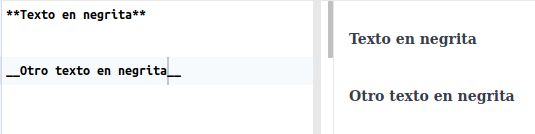
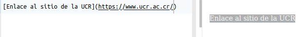

```{r setup, include=FALSE}
knitr::opts_chunk$set(echo = TRUE)
```

# Resumen
En esta lección, se introduce el lenguaje de marcas R Markdown.

# Trabajo previo
- Lea los capítulos del 1 al 3 de [Xie, Y., Allaire, J., & Grolemund, G. (2018). R Markdown: The Definitive Guide](https://bookdown.org/yihui/rmarkdown/).
- También se recomienda:
    - [R Markdown (sitio oficial)](https://rmarkdown.rstudio.com/).  
    - [Yihui Xie | One R Markdown Document, Fourteen Demos | RStudio (2020)](https://www.youtube.com/watch?v=qLEkUjxk7e8).  
    - [Reproducible reports with R Markdown](https://rmarkdown-shilaan.netlify.app/).  
    - [Reproducible Templates for Analysis and Dissemination](https://www.coursera.org/learn/reproducible-templates-analysis).  
    - [Introduction to Blogdown (R Package) | RStudio Webinar - 2017](https://www.youtube.com/watch?v=CjTLN-FXiFA).  
    - [Steps to create website with blogdown and the Hugo Academic (Wowchemy) theme](https://www.emmanuelteitelbaum.com/post/create-a-website-with-blogdown-and-hugo/).    
    - [How To Hugo Academic](https://www.youtube.com/watch?v=BHpkLJieXPE).  

# Descripción general
[R Markdown](https://rmarkdown.rstudio.com/) es un formato de archivo para construir documentos dinámicos con el lenguaje de programación [R](https://www.r-project.org/) y el lenguaje de marcado [Markdown](https://daringfireball.net/projects/markdown/).

# Markdown
[Markdown](https://daringfireball.net/projects/markdown/) es un [lenguaje de marcas](https://es.wikipedia.org/wiki/Lenguaje_de_marcado) creado en 2004 por John Gruber. Las "marcas" se utilizan para brindar información acerca de la presentación (ej. negritas, itálicas) o la estructura (ej. títulos, encabezados) de un documento. Se caracteriza por ser más sencillo de leer y de usar que otros lenguajes de marcas (ej. [HTML](https://es.wikipedia.org/wiki/HTML)). Los documentos escritos en Markdown pueden exportarse a una gran variedad de formatos (ej. HTML, Doc, PDF, Latex) para ser usados en libros, presentaciones o páginas web, entre otros. Markdown es ampliamente utilizado en comunicación científica, documentación de programas e investigación reproducible.

## Variaciones
Las variaciones de Markdown, también llamadas _flavors_, son extensiones o modificaciones de la especificación original. Entre las más populares están:

* [R Markdown](https://rmarkdown.rstudio.com/): para el lenguaje R.
* [MyST (Markedly Structured Text) Markdown](https://jupyterbook.org/content/myst.html): para [Jupyter Book](https://jupyterbook.org/).
* [GitHub Flavored Markdown](https://help.github.com/en/github/writing-on-github): para la plataforma GitHub.

Puede consultarse una lista más extensa en [https://github.com/commonmark/commonmark-spec/wiki/markdown-flavors](https://github.com/commonmark/commonmark-spec/wiki/markdown-flavors).

## Sintaxis
La sintaxis de Markdown permite especificar diferentes componentes de un documento, entre los que están:

- Encabezados.
- Estilos (ej. negritas, itálicas).
- Citas textuales.
- Enlaces a otros documentos (ej. páginas web).
- Imágenes.
- Listas.

### Encabezados
Pueden definirse seis niveles de encabezados, con los símbolos de numeral (#) antes del texto. El primer nivel es el más grande y el sexto el más pequeño. A la izquierda se muestra la sintaxis Markdown y a la derecha la forma en que se despliega en un documento.


### Itálicas
Se definen con un asterisco (*) antes y después del texto o con un guión bajo (_) antes y después del texto.


### Negritas
Se definen con dos asteriscos (**) antes y después del texto o con dos guiones bajos (__) antes y después del texto.



### Citas textuales
Se definen con un símbolo de "mayor que" (>) antes de cada línea.


### Enlaces a otros documentos
Se definen con un paréntesis cuadrados[] seguidos de paréntesis redondos (). En los paréntesis cuadrados se coloca (opcionalmente) el texto del enlace y en los redondos la dirección del documento.



### Imágenes
Se definen con un signo de admiración de cierre (!), paréntesis cuadrados[] y paréntesis redondos (). En los paréntesis cuadrados se coloca (opcionalmente) un texto para la imagen y en los redondos la dirección de la imagen, ya sea en el disco o en la red.


### Listas numeradas
Se definen con números antes de cada elemento.


### Listas no numeradas
Se definen con guiones antes de cada elemento.


### Otros elementos de sintaxis
Para conocer otros elementos de la sintaxis de Markdown, se recomienda revisar en detalle:

- Guía de referencia de Markdown: [Markdown Guide](https://www.markdownguide.org/)
- Tutorial sobre Markdown: [Markdown Tutorial](https://www.markdowntutorial.com/)
