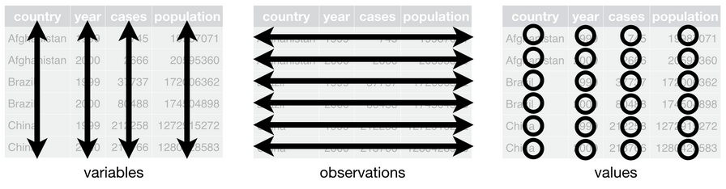

```{r setup, include=FALSE}
knitr::opts_chunk$set(echo = TRUE)
```

# Resumen
[Tidyverse](https://www.tidyverse.org/) es una colección de paquetes de R enfocados en [ciencia de datos](https://es.wikipedia.org/wiki/Ciencia_de_datos), los cuales *"comparten filosofía de diseño, gramática y estructuras de datos"*, de acuerdo con el sitio web de la iniciativa. El concepto de Tidyverse fue introducido por [Hadley Wickham](http://hadley.nz/), quien también programó varios de sus paquetes.

El núcleo de Tidyverse está compuesto por [ocho paquetes base](https://www.tidyverse.org/packages/#core-tidyverse), los cuales proveen las funcionalidades utilizadas más frecuentemente en análisis de datos. Hay [otros paquetes](https://www.tidyverse.org/packages/) para tareas más especifícas relacionadas con importación, limpieza y modelado de datos, entre otras áreas. Los paquetes de Tidyverse son de los [más descargados](https://www.r-pkg.org/downloaded), entre la totalidad de paquetes de R.

En esta lección, se explican algunos de los principales paquetes de Tidyverse.

# Trabajo previo
Lea los capítulos del 1 al 21 de [Wickhan, H. & Grolemund, G. (2018). R for Data Science: Import, Tidy, Transform, Visualize, and Model Data](https://r4ds.had.co.nz/).

# Preparativos

## Carga de paquetes

```{r message = FALSE}
# dplyr
library(dplyr)
```

## Conjuntos de datos utilizados en los ejemplos

**Datos hidrológicos**  
Este conjunto de datos contiene mediciones de caudal en varios ríos de Costa Rica.

```{r}
# Carga de datos desde un archivo CSV
rios <-
  read.csv(file = 'https://raw.githubusercontent.com/tpb728O-programaciongeoespacialr/2021ii/main/datos/hidrologia/fdc/fdc.csv')
```

**Casos de covid en Costa Rica**  
Este conjunto de datos es publicado por el [Ministerio de Salud de Costa Rica](http://geovision.uned.ac.cr/oges/). Contiene un registro por día con las estadísticas de casos positivos, fallecidos, activos y recuperados.

```{r}
# Carga de datos desde un archivo CSV
covid <- 
  read.csv(
    file='https://raw.githubusercontent.com/tpb728O-programaciongeoespacialr/2021ii/main/datos/minsalud/covid/ultimafecha_CSV_GENERAL.csv', 
    sep = ","
  )
```

```{r eval=FALSE}
# Despliegue de los datos
View(cr_covid19)
```

# Datos *tidy*
Los paquetes de Tidyverse trabajan con [datos *tidy*](https://www.jstatsoft.org/article/view/v059i10) (i.e. ordenados, organizados), un concepto también introducido por Hadley Wickham y que se está relacionado con la organización de los datos en estructuras rectangulares de filas y columnas, similares a las tablas o matrices.

Según Wickham, los datos *tidy* deben cumplir con tres características:

1. Cada variable debe tener su propia columna.
2. Cada observación debe tener su propia fila.
3. Cada valor debe tener su propia celda.

Estas características se ilustran en la figura 1.



El empleo de este modelo de datos uniforme en todos los paquetes de Tidyverse posibilita aprender y usar sus funciones con mayor facilidad. Además, permite invertir menos esfuerzo en lidiar con diferentes modelos de datos y así dedicar más tiempo y esfuerzo en los problemas de análisis a resolver.

# El paquete dplyr
El paquete [dplyr](https://dplyr.tidyverse.org/) de [Tidyverse](https://www.tidyverse.org/) es descrito como una *"gramática para la manipulación de datos, la cual proporciona un conjunto consistente de verbos que ayuda a solucionar los retos de manipulación de datos más comunes"*. Los principales "verbos" (i.e. funciones) de esta gramática son:

* [mutate()](https://dplyr.tidyverse.org/reference/mutate.html): crea nuevas variables, las cuales se expresan como funciones de variables existentes.

* [select()](https://dplyr.tidyverse.org/reference/select.html): selecciona variables con base en sus nombres.

* [filter()](https://dplyr.tidyverse.org/reference/filter.html): selecciona observaciones con base en sus valores.

* [arrange()](https://dplyr.tidyverse.org/reference/arrange.html): cambia el orden de las filas.

* [summarise()](https://dplyr.tidyverse.org/reference/summarise.html): agrupa y resume valores.

Todas estas operaciones pueden combinarse con la función [group_by()](https://dplyr.tidyverse.org/reference/group_by.html), la cual ejecuta cualquiera de las operaciones anteriores "en grupo". Además, dplyr proporciona [funciones adicionales](https://dplyr.tidyverse.org/reference/index.html) para tareas más específicas.

Todas las funciones de dplyr trabajan de manera similar:

1. El primer argumento es un data frame. Puede omitirse si la función recibe el data frame a través del operador *pipe*.
2. Los argumentos siguientes describen que hacer con el data frame, utilizando los nombres de las variables (sin comillas).  
3. El resultado es un nuevo data frame.

Las funciones de dplyr pueden encadenarse a través del operador [*pipe* (%>%)](https://magrittr.tidyverse.org/reference/pipe.html) (tubo), para formar *pipelines* (tuberías). En este contexto, un *pipeline* consiste de una cadena de procesos conectados de forma tal que la salida de cada proceso de la cadena es la entrada del próximo. Esto permite la comunicación y sincronización entre los procesos.

## La función ```mutate()```
La función [mutate()](https://dplyr.tidyverse.org/reference/mutate.html) crea nuevas variables en un data frame, las cuales se expresan como funciones de variables existentes. También puede utilizarse para recalcular una variable ya existente.

En el siguiente bloque de código, se utiliza ```mutate()``` para crear una nueva variable en el data frame de ríos. Se utilizan también otras funciones para renombrar las columnas y desplegar los datos.

```{r}
# Despliegue de la estructura del data frame
str(rios)

# Despliegue de los primeros registros
slice_head(rios, n = 5)

# Cambio de nombre de las columnas mediante rename()
rios <-
  rios %>%
  rename(fecha = Tiempo,
         pandora = Pandora.mm..637km2.,
         banano = Banano.mm..90km2.)

# Conversión de una columna a tipo Date y creación de una nueva columna
rios <-
  rios %>%
  mutate(fecha = as.Date(fecha, format = "%m/%d/%Y"),
         promedio = (pandora + banano) / 2)

# Verificación de los cambios en la estructura del data frame
str(rios)

# Visualización de los valores de la nueva columna
slice_head(rios, n = 5)
```

## La función ```select()```
La función [select()](https://dplyr.tidyverse.org/reference/select.html) selecciona variables (i.e. columnas) de un data frame con base en sus nombres.

En el siguiente bloque de código, se utiiza  ```select() ``` para seleccionar un conjunto de variables del data frame de COVID-19 en Costa Rica. El resultado se guarda en un nuevo data frame.

```{r}
# Selección, renombramiento y conversión de columnas
covid_columnas_seleccionadas <-
  covid %>%
  select(FECHA, muj_posi, hom_posi) %>%
  rename(
    fecha = FECHA,
    positivos_mujeres = muj_posi,
    positivos_hombres = hom_posi
  ) %>%
  mutate(fecha = as.Date(fecha, format = "%d/%m/%Y"))

# Despliegue de una muestra aleatoria de los registros
slice_sample(covid_columnas_seleccionadas, n = 5)
```

## La función ```filter()```
La función [filter()](https://dplyr.tidyverse.org/reference/filter.html) selecciona observaciones (i.e. filas) de un data frame con base en sus valores.

En el siguiente bloque de código, se utiliza ```filter()``` para filtrar el data frame de COVID-19 en Costa Rica. El resultado se guarda en un nuevo data frame.

```{r}
# Selección, renombramiento, conversión de columnas y filtrado
covid_filtrado <-
  covid %>%
  select(FECHA, nue_posi) %>%
  rename(fecha = FECHA, positivos_nuevos = nue_posi) %>%
  mutate(fecha = as.Date(fecha, format = "%d/%m/%Y")) %>%
  filter(positivos_nuevos >= 2500)

# Despliegue del data frame con los resultados
covid_filtrado
```

## La función ```arrange()```
La función [arrange()](https://dplyr.tidyverse.org/reference/arrange.html) cambia el orden de las observaciones (i.e. filas) de un dataframe.

En el siguiente bloque de código, se utiliza ```arrange()``` para ordenar el data frame de COVID-19 en Costa Rica, después de filtrarlo. El resultado se guarda en un nuevo data frame.

```{r}
# Selección, renombramiento, filtrado y conversión de columnas
covid_filtrado_ordenado_x_positivos_nuevos <-
  covid %>%
  select(FECHA, nue_posi) %>%
  rename(fecha = FECHA, positivos_nuevos = nue_posi) %>%
  mutate(fecha = as.Date(fecha, format = "%d/%m/%Y")) %>%
  filter(positivos_nuevos >= 2500) %>%
  arrange(desc(positivos_nuevos))

# Despliegue del data frame con los resultados
covid_filtrado_ordenado_x_positivos_nuevos
```

## La función ```summarise()```
La función [summarise()](https://dplyr.tidyverse.org/reference/summarise.html) agrupa y resume valores de un data frame. Generalmente, se utiliza conjuntamente con [group_by()](https://dplyr.tidyverse.org/reference/group_by.html), para agrupar antes los datos.

En el siguiente bloque de código, se utiliza ```summarise()``` para generar un nuevo data frame con los nuevos casos de COVID-19 sumarizados por mes.

```{r}
# Selección, renombramiento, filtrado y conversión de columnas
covid_positivos_nuevos_sumarizado_x_mes <-
  covid %>%
  select(FECHA, nue_posi) %>%
  rename(fecha = FECHA, positivos_nuevos = nue_posi) %>%
  mutate(fecha = as.Date(fecha, format = "%d/%m/%Y")) %>%
  group_by(anio = format(fecha,"%Y"), mes = format(fecha,"%m")) %>%
  summarise(suma_positivos = sum(positivos_nuevos))

# Despliegue del data frame con los resultados
covid_positivos_nuevos_sumarizado_x_mes
```

