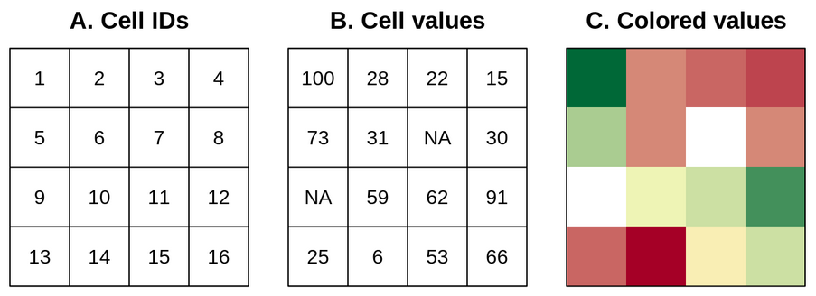

```{r setup, include=FALSE}
knitr::opts_chunk$set(echo = TRUE)
```

# Trabajo previo

Lea los capítulos del 1 al 2 de [Lovelace, R., Nowosad, J. & Muenchow, J. (2020). Geocomputation with R](https://geocompr.robinlovelace.net/).

# Preparativos

## Carga de paquetes

```{r paquetes, message=FALSE}
# Paquete para manipulación de datos
library(dplyr)

# Paquete para manejo de datos vectoriales
library(sf)

# Paquete para manejo de datos raster
library(terra)

# Paquete para mapas interactivos
library(leaflet)
```

## Conjuntos de datos

- [Provincias de Costa Rica](https://github.com/tpb728O-programaciongeoespacialr/2021ii/blob/main/datos/ign/delimitacion-territorial-administrativa/provincias.geojson)
- [Registros de presencia de *Felidae* (felinos) en Costa Rica](https://github.com/gf0604-procesamientodatosgeograficos/2021i-datos/blob/main/gbif/leopardus_pardalis-cr-registros.csv)
- [WorldClim](https://www.worldclim.org/)

# Introducción

La comunidad de programadores de R ha desarrollado un conjunto de paquetes para el manejo de datos geoespaciales, tanto en formatos vectoriales como raster. Algunos de los principales de estos paquetes son:

* El paquete [sf](https://cran.r-project.org/web/packages/sf/). Ofrece un conjunto de funciones para el manejo de datos vectoriales, de acuerdo con el estándar [Simple Features](https://www.ogc.org/standards/sfa).

* El paquete [terra](https://cran.r-project.org/web/packages/terra/). Implementa un conjunto de funciones para el manejo de datos raster. Es una reimplementación del paquete [raster](https://cran.r-project.org/web/packages/raster/).

* El paquete [leaflet](https://cran.r-project.org/web/packages/leaflet/). Es una implementación en R de la biblioteca [Leaflet para el lenguaje JavaScript](https://leafletjs.com/) para la programación de mapas interactivos en páginas web.

Algunos paquetes de graficación, como [ggplot2](https://cran.r-project.org/web/packages/ggplot2/), también cuentan con algunas capacidades para procesamiento de datos geoespaciales.

En [CRAN Task View: Analysis of Spatial Data](https://cran.r-project.org/web/views/Spatial.html), puede encontrarse un resumen detallado de los paquetes geoespaciales de R.

# Datos vectoriales

## El modelo vectorial

El modelo vectorial de datos está basado en puntos localizados en un [sistema de referencia de coordenadas (CRS)](https://en.wikipedia.org/wiki/Spatial_reference_system). Los puntos individuales pueden representar objetos independientes (ej. la localización de un poste eléctrico o de una cabina telefónica) o pueden también agruparse para formar geometrías más complejas como líneas o polígonos. Por lo general, los puntos tienen solo dos dimensiones (x, y), a las que se les puede agregar una tercera dimensión _z_, usualmente correspondiente a la altitud sobre el nivel del mar.

## El estándar Simple Features

[_Simple Features_](https://www.ogc.org/standards/sfa) (o _Simple Feature Access_) es un estándar abierto de la [Organización Internacional de Estandarización (ISO)](https://iso.org/) y del [_Open Geospatial Consortium_ (OGC)](https://www.ogc.org/) que especifica un modelo común de almacenamiento y acceso para geometrías de dos dimensiones (líneas, polígonos, multilíneas, multipolígonos, etc.). El estándar es implementado por muchas bibliotecas y bases de datos geoespaciales como [sf](https://cran.r-project.org/web/packages/sf/index.html), [GDAL](https://gdal.org/), [PostgreSQL/PostGIS](https://en.wikipedia.org/wiki/PostGIS), [SQLite/SpatiaLite](https://www.gaia-gis.it/fossil/libspatialite/), [Oracle Spatial](https://www.oracle.com/database/technologies/spatialandgraph.html) y [Microsoft SQL Server](https://www.microsoft.com/en-us/sql-server/), entre muchas otras.

La especificación define 17 tipos de geometrías, de las cuales siete son las más comúnmente utilizadas. Estas últimas se muestran en la figura 1.


## El paquete sf

El paquete [sf](https://r-spatial.github.io/sf/) (de _Simple Features_) de R implementa los modelos de datos de las geometrías de tipo vectorial: puntos, líneas, polígonos, sus versiones múltiples y las colecciones de geometrías. Está basado en bibliotecas de sofware ampliamente utilizadas en aplicaciones geoespaciales:

* **GDAL**: [Geospatial Data Abstraction Library (GDAL)](https://gdal.org/) es una biblioteca para leer y escribir datos geoespaciales en varios formatos [raster](https://gdal.org/drivers/raster/) y [vectoriales](https://gdal.org/drivers/vector/). Implementa un único [modelo abstracto de datos raster](https://gdal.org/user/raster_data_model.html) y un único [modelo abstracto de datos vectoriales](https://gdal.org/user/vector_data_model.html), lo que permite programar aplicaciones geoespaciales sin tener que ocuparse de las particularidades de cada formato que se utilice (GeoTIFF, NetCDF, ESRI Shapefile, GeoJSON, etc.). A pesar de que GDAL está programada en C/C++, cuenta con una interfaz de programación de aplicaciones (API) para varios lenguajes de programación, incluyendo [C](https://gdal.org/api/index.html#c-api), [C++](https://gdal.org/api/index.html#id3), [Python](https://gdal.org/python/index.html) y [Java](https://gdal.org/java/overview-summary.html). Además, ofrece un conjunto de [utilitarios de línea de comandos](https://gdal.org/programs/) cuyas [distribuciones binarias](https://gdal.org/download.html#binaries) están disponibles para varios sistemas operativos, incluyendo Windows, macOS y Linux.
* **GEOS**: [Geometry Engine, Open Source (GEOS)](https://trac.osgeo.org/geos) es una implmentación en C++ de la biblioteca [JTS Topology Suite](http://www.tsusiatsoftware.net/jts/main.html) (desarrollada en Java) y que implementa un conjunto de operaciones y predicados geoespaciales (ej. unión, intersección, distancia, área).
* **PROJ**: [PROJ](https://proj.org/) es una biblioteca que transforma coordenadas entre diferentes CRS, incluyendo tanto proyecciones cartográficas como transformaciones geodésicas.

sf provee acceso, desde un mismo paquete de R, a la funcionalidad de estas tres bibliotecas, proporcionando así una interfaz unificada para leer y escribir datos geoespaciales mediante GDAL, realizar operaciones con geometrías mediante GEOS y efectuar transformaciones entre sistemas de coordenadas mediante PROJ.

En sf, los conjuntos de datos geoespaciales se almacenan en objetos de una clase también llamada ```sf```, los cuales son data frames que contiene una columna especial para las geometrías. Esta columna se denomina generalmente ```geom``` o ```geometry``` (aunque pueden tener cualquier otro nombre). El manejo de datos geoespaciales como data frames permite manipularlos con las funciones ya desarrolladas para este tipo de datos y con la misma forma de referenciar las filas (observaciones) y las columnas (variables).

### Métodos del paquete sf

La lista de métodos de la clase ```sf``` puede obtenerse a través de la función [methods()](https://rdrr.io/r/utils/methods.html):

```{r metodos}
# Métodos de la clase sf
methods(class = "sf")
```

Seguidamente, se describen y ejemplifican algunos de los métodos básicos de la clase ```sf```.

#### st_read() - lectura de datos

La función [st_read()](https://r-spatial.github.io/sf/reference/st_read.html) lee datos vectoriales de una fuente en formato geoespacial (ej. shapefiles, archivos GeoJSON, bases de datos geoespaciales) y los recupera en un [objeto sf](https://r-spatial.github.io/sf/reference/sf.html).

```{r st_read-geoespacial}
# Lectura de una capa vectorial (GeoJSON) de provincias de Costa Rica
provincias <-
  st_read(
    "https://github.com/tpb728O-programaciongeoespacialr/2021ii/raw/main/datos/ign/delimitacion-territorial-administrativa/provincias.geojson",
    quiet = TRUE
  )
```

```st_read()``` también puede crear objetos ```sf``` a partir de archivos de texto.

```{r st_read-texto}
# Lectura de un archivo CSV con registros de presencia de felinos en Costa Rica
felidae <-
  st_read(
    "/home/mfvargas/tpb728O-programaciongeoespacialr/2021ii/datos/gbif/felidae.csv",
    drivers = "CSV", # esta opción parece ser necesario en las últimas versiones de GDAL cuando se lee a través de HTTP
    options = c(
      "X_POSSIBLE_NAMES=decimalLongitude",
      "Y_POSSIBLE_NAMES=decimalLatitude"
    ),
    quiet = TRUE
  )
```

Tanto ```provincias``` como ```felidae``` son objetos de la clase ```sf ``` (y además de ```data.frame```).

```{r clase}
# Clase del objeto provincias
class(provincias)

# Clase del objeto felidae
class(felidae)
```

Al escribirse el nombre de un objeto ```sf``` en la consola de R, se despliega información general sobre este.

```{r consola-sf}
# Información general sobre el objeto provincias
provincias
```

#### st_crs() y st_transform - manejo de sistemas de coordenadas

La función [st_crs()](https://r-spatial.github.io/sf/reference/st_crs.html) retorna el CRS de un objeto ```sf```.

```{r st_crs-1}
# CRS del objeto provincias
st_crs(provincias)

# CRS del objeto felidae 
st_crs(felidae)
```

```st_crs()``` también puede asignar un CRS a un objeto ```sf``` que no lo tiene.

```{r st_crs-2}
# Asignación de un CRS al objeto felidae
st_crs(felidae) <- 4326
```

La función [st_transform()](https://r-spatial.github.io/sf/reference/st_transform.html) transforma un objeto ```sf``` a un nuevo CRS.

```{r st_transform}
# Transformación del CRS del objeto provincias
provincias <-
  provincias %>%
  st_transform(4326)
```

#### plot() - mapeo

La función [plot()](https://r-spatial.github.io/sf/reference/plot.html) muestra objetos sf en un mapa. 

```{r sf-plot-01}
# Mapeo de las geometrías del objeto provincias
plot(provincias$geometry)

# Mapeo con argumentos adicionales de plot()
plot(
  provincias$geometry,
  extent = st_bbox(c(xmin = -86.0, xmax = -82.3, ymin = 8.0, ymax = 11.3)),
  main = "Provincias de Costa Rica",
  axes = TRUE,
  graticule = TRUE
)
```

Los argumentos ```reset``` y ```add``` de ```plot()``` permiten generar un mapa con varias capas.

```{r sf-plot-02}
# Primera capa del mapa
plot(
  provincias$geometry,
  extent = st_bbox(c(xmin = -86.0, xmax = -82.3, ymin = 8.0, ymax = 11.3)),
  main = "Distribución de registros de presencia de Felidae (felinos) en Costa Rica",
  axes = TRUE,
  graticule = TRUE,
  reset = FALSE
)

# Segunda capa
plot(felidae$geometry,
     add = TRUE,     
     pch = 16,
     col = "orange")
```

Para conocer los valores de pch, puede consultar [R plot pch symbols](http://www.sthda.com/english/wiki/r-plot-pch-symbols-the-different-point-shapes-available-in-r).

#### st_write - escritura de datos

La función [st_write()](https://r-spatial.github.io/sf/reference/st_write.html) guarda en el disco un objeto ```sf``` en los diferentes [formatos vectoriales de GDAL](https://gdal.org/drivers/vector/).

```{r st_write, eval=FALSE}
# Especificación del directorio de trabajo (debe utilizarse una ruta existente)
setwd("/home/mfvargas")

# Escritura del objeto provincias
provincias %>%
  st_write("provincias.shp")

# Escritura del objeto felidae
manigordos %>%
  st_write("felidae.kml")
```

### Mapeo de objetos sf con otros paquetes

#### leaflet
El paquete leaflet genera mapas interactivos en HTML.

```{r leaflet}
# Mapa leaflet básico con capas de provincias y registros de presencia de felinos
leaflet() %>%
  addTiles() %>%
  addPolygons(
    data = provincias,
    color = "black",
    fillColor = "transparent",
    stroke = TRUE,
    weight = 1.0,
  ) %>%
  addCircleMarkers(
    data = felidae,
    stroke = F,
    radius = 4,
    fillColor = 'orange',
    fillOpacity = 1
  )
```

# Datos raster

## El modelo raster
El modelo de datos raster usualmente consiste de un encabezado y de una matriz con celdas (también llamadas pixeles) de un mismo tamaño. El encabezado define el CRS, la extensión y el punto de origen de una capa raster. Por lo general, el origen se ubica en la esquina inferior izquierda o en la esquina superior izquierda de la matriz. La extensión se define mediante el número de filas, el número de columnas y el tamaño (resolución) de la celda.

Cada celda tiene una identificación (ID) y almacena un único valor, el cual puede ser numérico o categórico, como se muestra en la figura 2. 



A diferencia del modelo vectorial, el modelo raster no necesita almacenar todas las coordenadas de cada geometría (i.e. las esquinas de las celdas), debido a que la ubicación de cada celda puede calcularse a partir de la información contenida en el encabezado. Esta simplicidad, en conjunto con el [álgebra de mapas](https://en.wikipedia.org/wiki/Map_algebra), permiten que el procesamiento de datos raster sea mucho más eficiente que el procesamiento de datos vectoriales. Por otra parte, el modelo vectorial es mucho más flexible en cuanto a las posibilidades de representación de geometrías y almacenamiento de valores, por medio de múltiples elementos de datos.

Los mapas raster generalmente almacenan fenómenos continuos como elevación, precipitación, temperatura, densidad de población y datos espectrales. También es posible representar mediante raster datos discretos, tales como tipos de suelo o clases de cobertura de la tierra, como se muestra en la figura 3.


## El paquete terra
El paquete [terra](https://cran.r-project.org/web/packages/terra/) implementa un conjunto de funciones para la lectura, escritura, manipulación, análisis y modelado de datos raster.

```{r rast}
# Lectura de una capa raster de altitud
altitud <-
  rast(
    "/vsicurl/https://raw.githubusercontent.com/tpb728O-programaciongeoespacialr/2021ii/master/datos/worldclim/altitud.tif"
  )
```

```{r terra-plot-01}
plot(altitud)
```