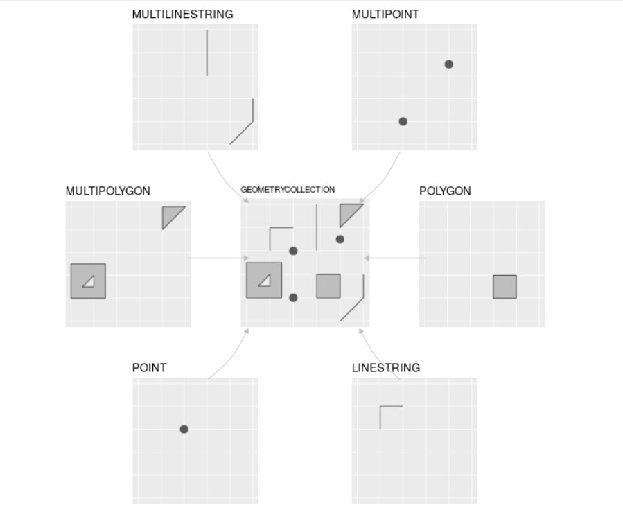

```{r setup, include=FALSE}
knitr::opts_chunk$set(echo = TRUE)
```

# Trabajo previo
Lea los capítulos del 1 al 2 de [Lovelace, R., Nowosad, J. & Muenchow, J. (2020). Geocomputation with R](https://geocompr.robinlovelace.net/).

# Preparativos

## Carga de paquetes

```{r message = FALSE}
library(dplyr)
library(ggplot2)
library(sf)
library(terra)
library(leaflet)
```

## Conjuntos de datos

- [Provincias de Costa Rica](https://github.com/tpb728O-programaciongeoespacialr/2021ii/blob/main/datos/ign/delimitacion-territorial-administrativa/provincias.geojson)
- [Registros de presencia de *Felidae* (felinos) en Costa Rica](https://github.com/gf0604-procesamientodatosgeograficos/2021i-datos/blob/main/gbif/leopardus_pardalis-cr-registros.csv)
- [WorldClim](https://www.worldclim.org/)

# Introducción
La comunidad de programadores de R ha desarrollado un conjunto de paquetes para el manejo de datos geoespaciales, tanto en formatos vectoriales como raster. Algunos de los principales de estos paquetes son:

* El paquete [sf](https://cran.r-project.org/web/packages/sf/). Ofrece un conjunto de funciones para el manejo de datos vectoriales, de acuerdo con el estándar [Simple Features](https://www.ogc.org/standards/sfa).

* El paquete [terra](https://cran.r-project.org/web/packages/terra/). Implementa un conjunto de funciones para el manejo de datos raster. Es una reimplementación del paquete [raster](https://cran.r-project.org/web/packages/raster/).

* El paquete [leaflet](https://cran.r-project.org/web/packages/leaflet/). Es una implementación en R de la biblioteca [Leaflet para el lenguaje JavaScript](https://leafletjs.com/) para la programación de mapas interactivos en páginas web.

Algunos paquetes de graficación, como [ggplot2](https://ggplot2.tidyverse.org/), también cuentan con algunas capacidades para procesamiento de datos geoespaciales.

En [CRAN Task View: Analysis of Spatial Data](https://cran.r-project.org/web/views/Spatial.html), puede encontrarse un resumen detallado de los paquetes geoespaciales de R.

# Datos vectoriales

## El modelo vectorial
El modelo vectorial de datos está basado en puntos localizados en un [sistema de referencia de coordenadas (CRS)](https://en.wikipedia.org/wiki/Spatial_reference_system). Los puntos individuales pueden representar objetos independientes (ej. la localización de un poste eléctrico o de una cabina telefónica) o pueden también agruparse para formar geometrías más complejas como líneas o polígonos. Por lo general, los puntos tienen solo dos dimensiones (x, y), a las que se les puede agregar una tercera dimensión _z_, usualmente correspondiente a la altitud sobre el nivel del mar.

## El estándar _Simple Features_
[_Simple Features_](https://www.ogc.org/standards/sfa) (o _Simple Feature Access_) es un estándar abierto de la [Organización Internacional de Estandarización (ISO)](https://iso.org/) y del [_Open Geospatial Consortium_ (OGC)](https://www.ogc.org/) que especifica un modelo común de almacenamiento y acceso para geometrías de dos dimensiones (líneas, polígonos, multilíneas, multipolígonos, etc.). El estándar es implementado por muchas bibliotecas y bases de datos geoespaciales como [sf](https://cran.r-project.org/web/packages/sf/index.html), [GDAL](https://gdal.org/), [PostgreSQL/PostGIS](https://en.wikipedia.org/wiki/PostGIS), [SQLite/SpatiaLite](https://www.gaia-gis.it/fossil/libspatialite/), [Oracle Spatial](https://www.oracle.com/database/technologies/spatialandgraph.html) y [Microsoft SQL Server](https://www.microsoft.com/en-us/sql-server/), entre muchas otras.

La especificación define 17 tipos de geometrías, de las cuales siete son las más comúnmente utilizadas. Estas últimas se muestran en la figura 1.



## El paquete sf
El paquete [sf](https://r-spatial.github.io/sf/) (de _Simple Features_) de R implementa los modelos de datos de las geometrías de tipo vectorial: puntos, líneas, polígonos, sus versiones múltiples y las colecciones de geometrías. Está basado en bibliotecas de sofware ampliamente utilizadas en aplicaciones geoespaciales:

* **GDAL**: [Geospatial Data Abstraction Library (GDAL)](https://gdal.org/) es una biblioteca para leer y escribir datos geoespaciales en varios formatos [raster](https://gdal.org/drivers/raster/) y [vectoriales](https://gdal.org/drivers/vector/). Implementa un único [modelo abstracto de datos raster](https://gdal.org/user/raster_data_model.html) y un único [modelo abstracto de datos vectoriales](https://gdal.org/user/vector_data_model.html), lo que permite programar aplicaciones geoespaciales sin tener que ocuparse de las particularidades de cada formato que se utilice (GeoTIFF, NetCDF, ESRI Shapefile, GeoJSON, etc.). A pesar de que GDAL está programada en C/C++, cuenta con una interfaz de programación de aplicaciones (API) para varios lenguajes de programación, incluyendo [C](https://gdal.org/api/index.html#c-api), [C++](https://gdal.org/api/index.html#id3), [Python](https://gdal.org/python/index.html) y [Java](https://gdal.org/java/overview-summary.html). Además, ofrece un conjunto de [utilitarios de línea de comandos](https://gdal.org/programs/) cuyas [distribuciones binarias](https://gdal.org/download.html#binaries) están disponibles para varios sistemas operativos, incluyendo Windows, macOS y Linux.
* **GEOS**: [Geometry Engine, Open Source (GEOS)](https://trac.osgeo.org/geos) es una implmentación en C++ de la biblioteca [JTS Topology Suite](http://www.tsusiatsoftware.net/jts/main.html) (desarrollada en Java) y que implementa un conjunto de operaciones y predicados geoespaciales (ej. unión, intersección, distancia, área).
* **PROJ**: [PROJ](https://proj.org/) es una biblioteca que transforma coordenadas entre diferentes CRS, incluyendo tanto proyecciones cartográficas como transformaciones geodésicas.

sf provee acceso, desde un mismo paquete de R, a la funcionalidad de estas tres bibliotecas, proporcionando así una interfaz unificada para leer y escribir datos geoespaciales mediante GDAL, realizar operaciones con geometrías mediante GEOS y efectuar transformaciones entre sistemas de coordenadas mediante PROJ.

En sf, los conjuntos de datos geoespaciales se almacenan en un data frame que contiene una columna especial para las geometrías. Esta columna se denomina generalmente ```geom``` o ```geometry```. El manejo de datos geoespaciales como data frames, permite manipularlos con las funciones ya desarrolladas para data frames y con la misma forma de referenciar las filas (observaciones) y las columnas (variables).

